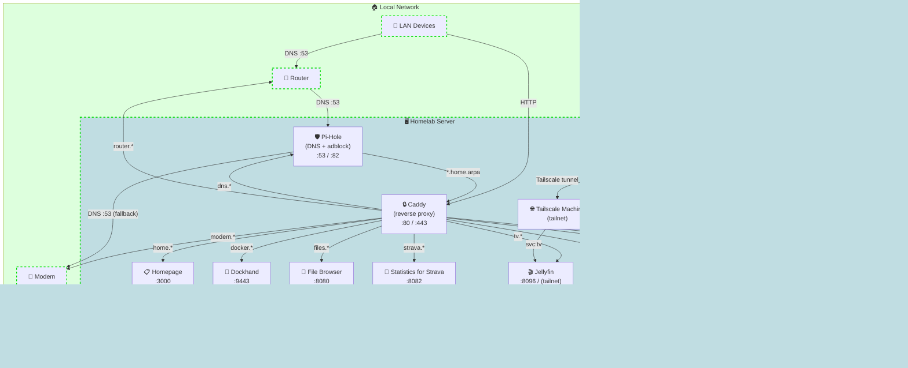

# Homelab

Configuration files used to self-host my own homelab.

Any encountered documentation in this repository is mainly for me as I can quickly forget things :)
and it might be out of date.

## Structure

`stacks/` directory stores configuration of all other services, split into categories.

## Network diagram

> [!WARNING]
> The diagram shows a high level overview of interaction between services and other network
> devices. Some services are encapsulated further in private docker networks.

<!-- TODO: create readme.md in streaming stack -->
<!-- TODO: Tailscale setup -->
<!-- TODO: split the diagram into several ones across stacks with different level of details -->

