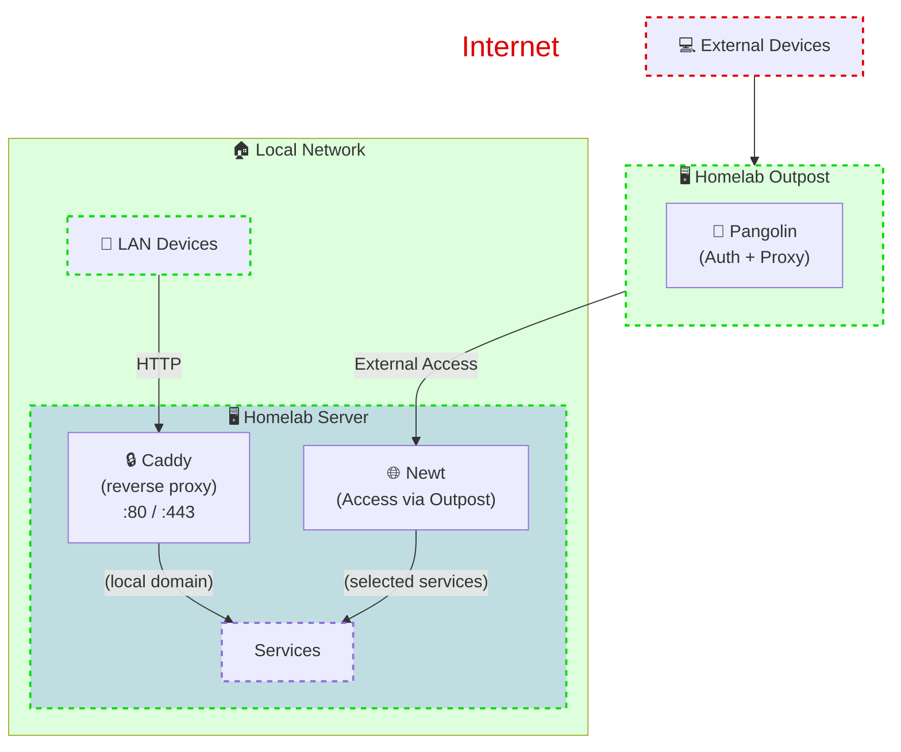
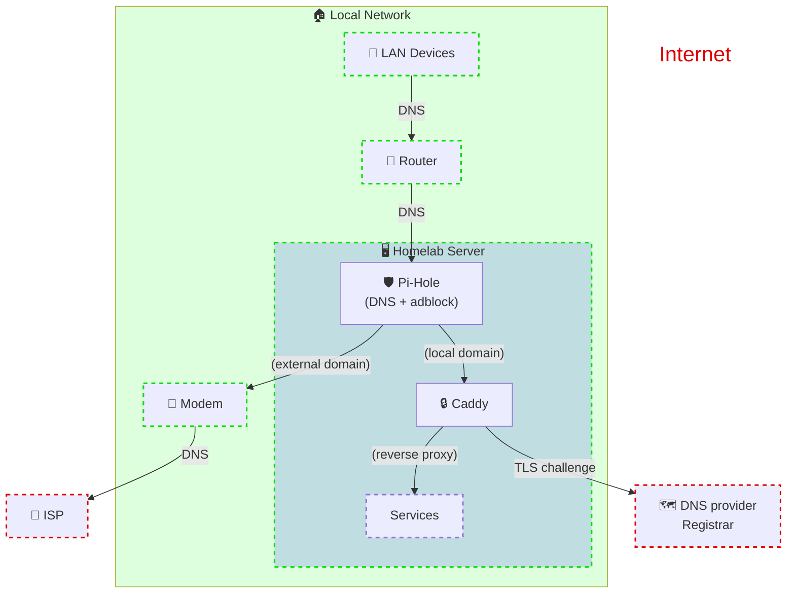

# Homelab

Configuration files used to self-host my own homelab.

Any encountered documentation in this repository is mainly for me as some configuration is
(over)complicated :) and it might be out of date.

## Structure

`stacks/` directory stores configuration of all other services, split into categories.

| Stack           | Description                                               |
| --------------- | --------------------------------------------------------- |
| `management`    | Services crucial for working of the homelab.              |
| `monitoring`    | Overview of the state and health of all services.         |
| `storage`       | Storage and backup management.                            |
| `streaming`     | Home media management and streaming services.             |
| `apps`          | Various standalone apps                                   |
| `homeassistant` | `TO-DO` Smart home devices management.                    |

## Entrypoint

There isn't a single entrypoint to running all services at once, but the most important is
`management` stack, as it contains crucial services for correct working of the whole homelab, such
as DNS, reverse proxy, external access etc. Therefore, it should be started first.

## Network overview

```mermaid
graph TB
    FreeLabel["Internet"]:::invisible

    ExtDev["💻 External Devices"]

    subgraph Outpost["🖥️ Homelab Outpost"]
        Pangolin["🔗 Pangolin<br/>(Auth + Proxy)"]
    end

    subgraph LAN["🏠 Local Network"]
        LAN_Devices["📱 LAN Devices"]

        subgraph Host["🖥️ Homelab Server"]
            Caddy["🔒 Caddy<br/>(reverse proxy)<br/>:80 / :443"]
            Services["Services"]

            Newt["🌐 Newt</br>(Access via Outpost)"]
        end
    end

    %% Caddy reverse proxies
    Caddy -->|"(local domain)"| Services

    %% External access
    Outpost -->|"External Access"| Newt
    ExtDev --> Outpost
    Newt -->|"(selected services)"| Services

    %% LAN device access
    LAN_Devices -->|"HTTP"| Caddy

    %% Styling
    classDef invisible fill:none,stroke:none,color:#dd0000,font-size:20pt
    classDef localdevice stroke:#00dd00,stroke-dasharray: 5 5,stroke-width:2px
    classDef externaldevice stroke:#dd0000,stroke-dasharray: 5 5,stroke-width:2px
    classDef localnet fill:#00ff0022
    classDef outpostnet fill:#00ff0022,stroke:#00dd00,stroke-dasharray: 5 5,stroke-width:2px
    classDef dockernet fill:#0000ff22
    classDef reference stroke-dasharray: 5 5,stroke-width:2px

    class LAN_Devices,Host localdevice
    class ExtPC,Tailscale_Server,Outpost,ExtDev externaldevice
    class LAN localnet
    class Outpost outpostnet
    class Host dockernet
    class Services reference
```

### DNS resolution

```mermaid
graph TB
    FreeLabel["Internet"]:::invisible

    ISP["📡 ISP"]
    DNSSP["🗺️ DNS provider<br/>Registrar"]

    subgraph LAN["🏠 Local Network"]
        Router["🔌 Router"]
        Modem["📡 Modem"]
        LAN_Devices["📱 LAN Devices"]

        subgraph Host["🖥️ Homelab Server"]
            Caddy["🔒 Caddy<br/>"]
            PiHole["🛡️ Pi-Hole<br/>(DNS + adblock)"]
            Services["Services"]
        end
    end

    Caddy -->|"(reverse proxy)"| Services

    %% Caddy uses DNS service provider for DNS-01 TLS challenge
    Caddy -->|"TLS challenge"| DNSSP

    %% DNS resolution
    LAN_Devices -->|"DNS"| Router
    Router -->|"DNS"| PiHole
    PiHole -->|"(external domain)"| Modem
    Modem -->|"DNS"| ISP
    PiHole -->|"(local domain)"| Caddy

    %% Styling
    classDef invisible fill:none,stroke:none,color:#dd0000,font-size:20pt
    classDef localdevice stroke:#00dd00,stroke-dasharray: 5 5,stroke-width:2px
    classDef externaldevice stroke:#dd0000,stroke-dasharray: 5 5,stroke-width:2px
    classDef localnet fill:#00ff0022
    classDef dockernet fill:#0000ff22
    classDef reference stroke-dasharray: 5 5,stroke-width:2px

    class Router,Modem,LAN_Devices,Host localdevice
    class ISP,DNSSP externaldevice
    class LAN localnet
    class Host dockernet
    class Services reference
```

## Homelab Outpost™️

**Homelab Outpost** is a remote host that cooperates with the local homelab. In this case, only one is currently in use and its configuration is available in
[this repository](https://github.com/vis4rd/homelab-outpost).
